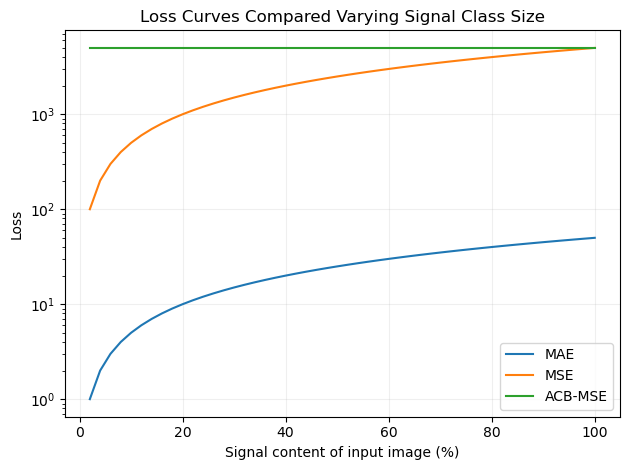
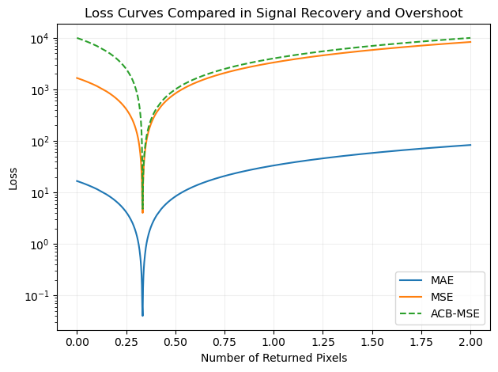

# ACB-MSE
Automatic-Class-Balanced MSE Loss function for PyTorch (ACB-MSE) to combat class imbalanced datasets. 

[](https://travis-ci.org/Adillwma/ACB-MSE)
[](https://codecov.io/gh/Adillwma/ACB-MSE)
[](https://www.python.org/)
[](https://opensource.org/licenses/MIT)

## Table of Contents
- [Introduction](#introduction)
- [Installation](#installation)
- [Usage](#usage)
- [Examples](#examples)
- [Demonstration](#demonstration)
- [Documentation](#documentation)
- [License](#license)
- [Contributions](#contributions)
- [Contact](#contact)
- [References](#references)

## Introduction 
This repository contains the PyTorch implementation of the ACB-MSE loss function, which stands for Automatic Class Balanced Mean Squared Error, originally developed for the [DEEPCLEAN3D Denoiser](#https://github.com/Adillwma/DeepClean-Noise-Suppression-for-LHC-B-Torch-Detector")


## Benefits
The ACB-MSE loss function was designed for data taken from particle detectors which often have a majority of 'pixels' which are unlit and a very sparse pattern of lit pixels. In this scenario the ACB-MSE loss provides two main benefits, addressing the class imbalance beteen lit and unlit pixels whilst also stabilising the loss gradient during training. Additonal parameters, 'A' and 'B', are provided to allow the user to set a custom balance between classes.

#### Variable Class Size - Training Stability
If the number of hit pixels varies dramatically between images during training it can cause the loss value to fluctuate. This The ACBMSE loss function solves this problem by automatically adjusting the weighting of the loss function to account for the number of hit pixels in the target image. 



Figure that demonstrates how each of the loss functions (ACB-MSE, MSE and MAE) behave based on the number of hits in the true signal. Two dummy images were created, the first image contains some ToF values of 100 the second image is a replica of the first but only containing the Tof values in half of the number of pixels of the first image, this simulates a 50% signal recovery. to generate the plot the first image was filled in two pixel increments with the second image following at a constant 50% recovery, and at each iteration the loss functions are calculated for the pair of images. We can see how the MSE and MAE functions loss varies as the size of the signal is increased. Whereas the ACB-MSE loss stays constant regardless of the frequency of the signal class.

The Loss functions response curve is demonstrated in fig \ref{fig:losscurves}. This show how the the ACB-MSE compares to vanilla MSE and also MAE. The addition of ACB balancing means that the separate classes (non hits and hits) are exactly balanced regardless of how large a proportion of the population they are in each input array. 


#### Class Imbalance - Local Minima
Class imbalance is an issue that can arise where the interesting features are contained in the minority class. In the case of the DEEPCLEAN3D data the input images contained 11,264 total pixels, with only around 200 of them being hits. For the network, just guessing that all the pixels are non-hits (zero valued) yields a very respectable 90+% reconstruction loss. During training, this local minima proved hard for the network to escape from. Class balancing based on class frequency is a simple solution to this problem which shifts the loss landscape as shown in the plot below. ??Moving to ACB-MSE for the scenrio outlined above means that guessing all the pixels are non hits results in a loss of 50% rather than 98.2%, and to improve on this the network must begin to fill in signal pixels.??



Explain image 2


## Installation
Available on PyPi
```bash
pip install ACB-MSE
```

#### Requirements
- Python 3.x
- PyTorch (tested with version 2.0.1)


## Usage
#### Class Parameters
- `zero_weighting` (float, optional): A scalar weighting coefficient for the MSE loss of zero pixels in the target image. Default is 1.
- `nonzero_weighting` (float, optional): A scalar weighting coefficient for the MSE loss of non-zero pixels in the target image. Default is 1.

#### Inputs
   - Input (torch.Tensor): $(*)$, where $(*)$ means any number of dimensions.
   - Target (torch.Tensor): $(*)$, same shape as the input.

#### Returns
- Output (float): Calculated loss value.


##### Example Usage
```python
import torch
from acbmse import ACBMSE

# Select weighting for each class if not wanting to use the defualt 1:1 weighting
zero_weighting = 1.0
nonzero_weighting = 1.2

# Create an instance of the ACBMSE loss function with specified weighting coefficients
loss_function = ACBMSE(zero_weighting, nonzero_weighting)

# Dummy target image and reconstructed image tensors (assuming B=1, C=3, H=256, W=256)
target_image = torch.rand(1, 3, 256, 256)
reconstructed_image = torch.rand(1, 3, 256, 256)

# Calculate the ACBMSE loss
loss = loss_function(reconstructed_image, target_image)
print("ACB-MSE Loss:", loss.item())
```


## Methodology and Equations
1. It creates two masks from the target image:
   - `zero_mask`: A boolean mask where elements are `True` for zero-valued pixels in the target image.
   - `nonzero_mask`: A boolean mask where elements are `True` for non-zero-valued pixels in the target image.
2. Extracts the pixel values from both the target image and the reconstructed image corresponding to zero and non-zero masks.
3. Calculates the mean squared error loss for the pixel values associated with each mask.
4. Multiplies the losses with the corresponding weighting coefficients (`zero_weighting` and `nonzero_weighting`).
5. Returns the weighted MSE loss as the final loss value.

Please note that any NaN loss values resulting from the calculation are handled by setting them to zero.

The function relies on the knowledge of the indices for all hits and non-hits in the true label image, which are then compared to the values in the corresponding index's in the recovered image. The loss function is given by:

$$ \text{Loss} = {A(\frac{1}{N_h}\sum_{i=1}^{N_h}(y_i - \hat{y}_i)^2)} + {B(\frac{1}{N_n}\sum_{i=1}^{N_n}(y_i - \hat{y}_i)^2)}$$

$$ \text{Loss} = B(\frac{1}{N_n}\sum_{i=1}^{N_n}(y_i - \hat{y}_i)^2) $$


$$ \text{Loss} = A(\frac{1}{N_h}\sum_{i=1}^{N_h}(y_i - \hat{y}_i)^2) + B(\frac{1}{N_n}\sum_{i=1}^{N_n}(y_i - \hat{y}_i)^2) $$

where $y_i$ is the true value of the $i$-th pixel in the class, $\hat{y}_i$ is the predicted value of the $i$-th pixel in the class, and $n$ is the total number of pixels in the class (in our case labeled as $N_h$ and $N_n$ corresponding to 'hits' and 'no hits' classes, but can be extended to n classes). This approach to the loss function calculation takes the mean square of each class separately, when summing the separate classes errors back together they are automatically scaled by the inverse of the class frequency, normalising the class balance to 1:1. The additional coefficients $A$ and $B$ allow the user to manually adjust the balance to fine tune the balance.


## License
This project is licensed under the MIT License - see the [LICENSE.md](LICENSE.md) file for details.

## Contributions
Contributions to this codebase are welcome! If you encounter any issues or have suggestions for improvements please open an issue or a pull request on the [GitHub repository](https://github.com/Adillwma/ACB-MSE).

## Contact
For any inquiries, feel free to reach out to me at adillwmaa@gmail.com.


